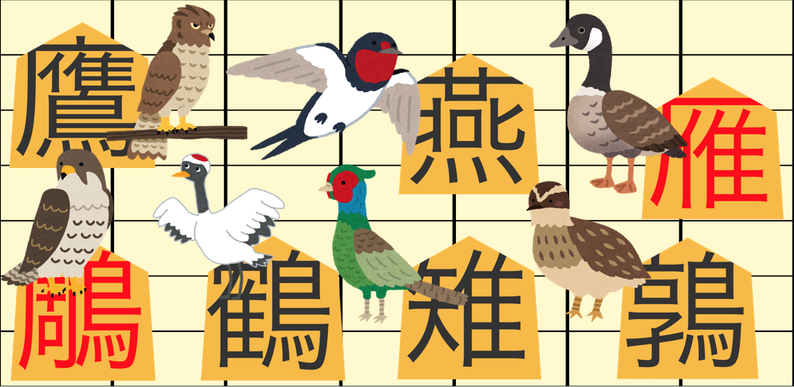
# <ruby>禽将棋<rp>（</rp><rt>とりしょうぎ</rt><rp>）</rp></ruby>(Japanese Bird Chess)

江戸時代に日本で生まれた禽将棋です。
現代の将棋と似てますが、すべての駒に鳥の名前が付いています。
昔Androidアプリとして公開していたものを、イラスト駒を追加してPC版として公開しました。  

|駒の種類  | 楷書駒 | 毛筆駒 | イラスト駒 |
|:-----  | :-----: | :-----: | :-----: |
| 鵬<br />Ootori | 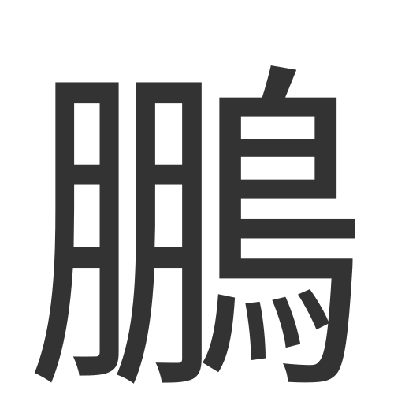 | 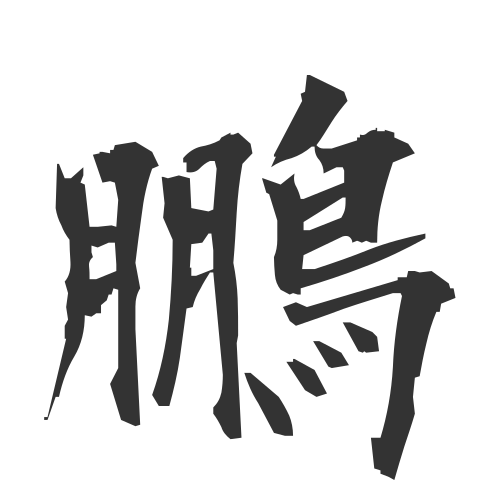 | 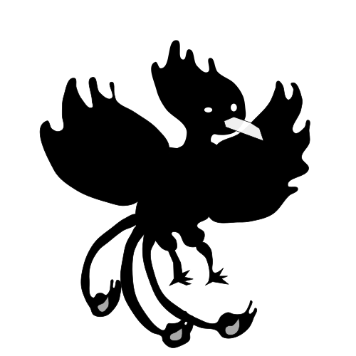 |
| 鷹<br />Taka | 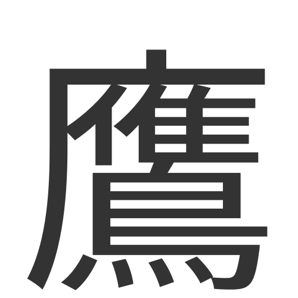 | 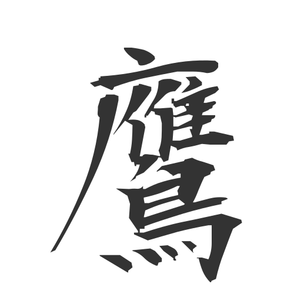 | 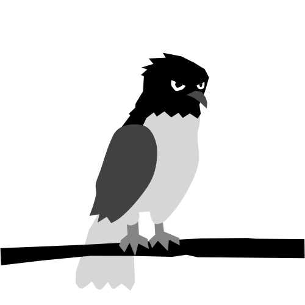 |
| 鵰<br />Kumataka | 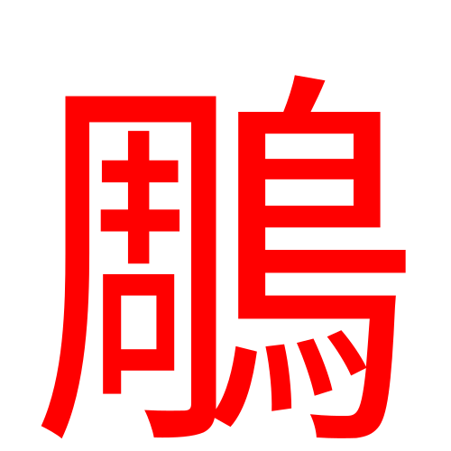 | 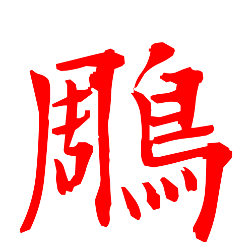 | 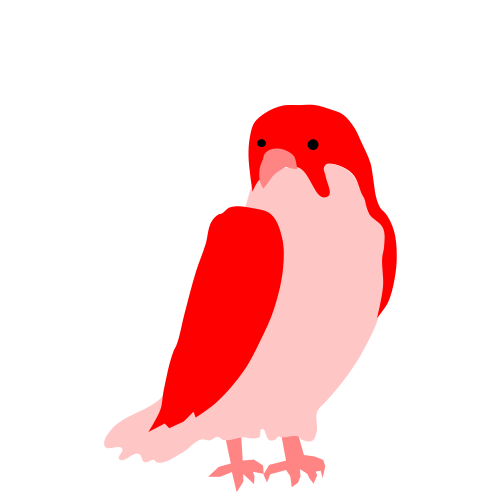 |
| 鶴<br />Tsuru | 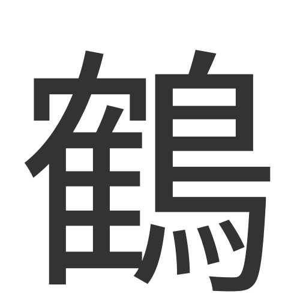 | 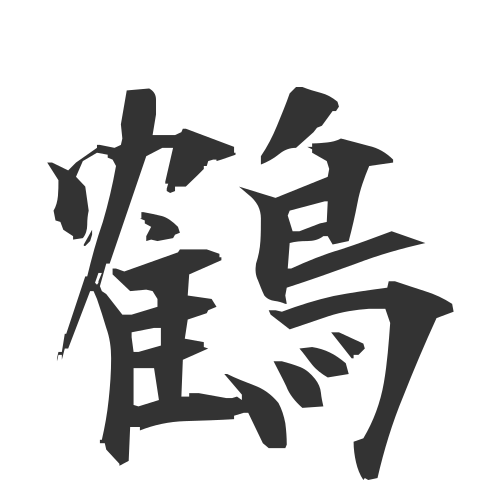 | 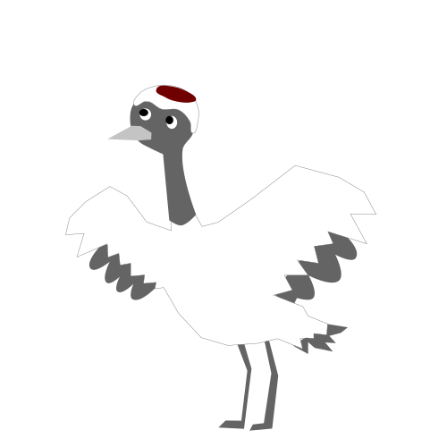 |
| 雉<br />Kizi | 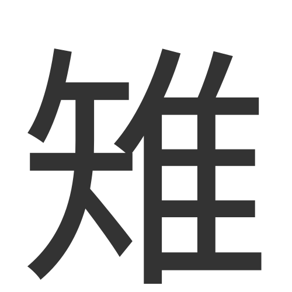 | 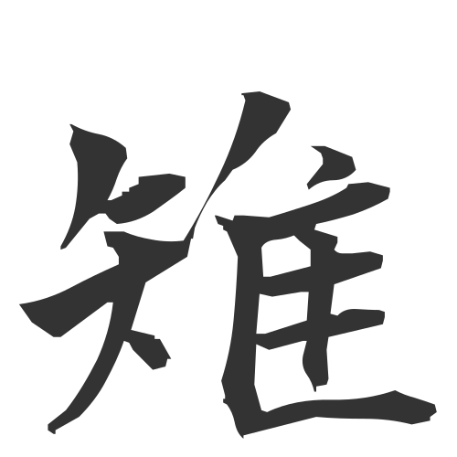 | 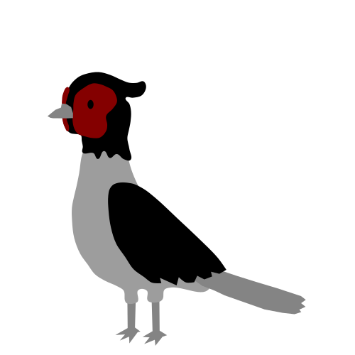 |
| 左鶉<br />Hidari Uzura |  | 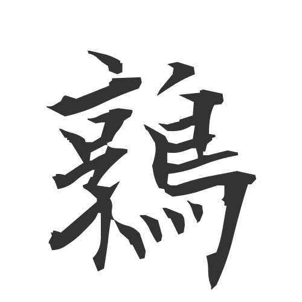 | 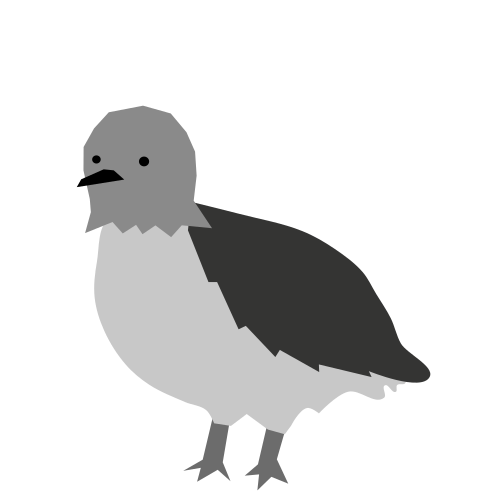 |
| 右鶉<br />Migi Uzura | 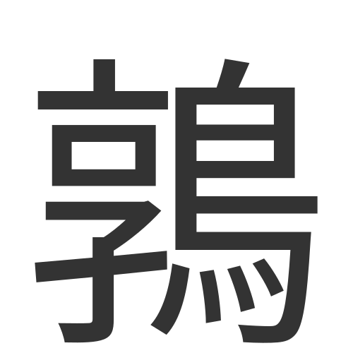 |  | 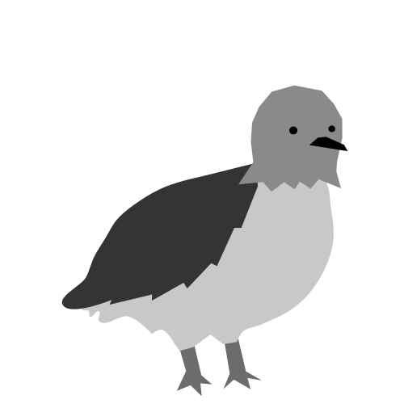 |
| 燕<br />Tsubame | 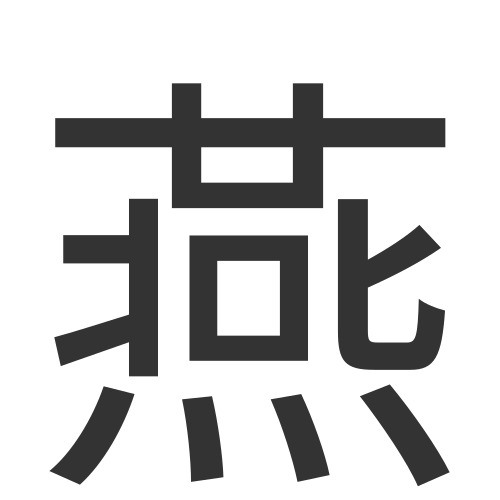 | 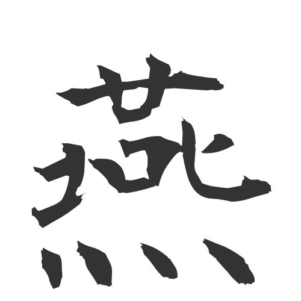 | 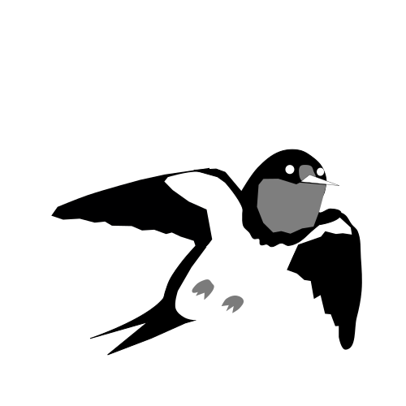 |
| 雁<br />Kari | 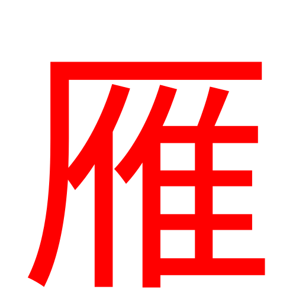 | 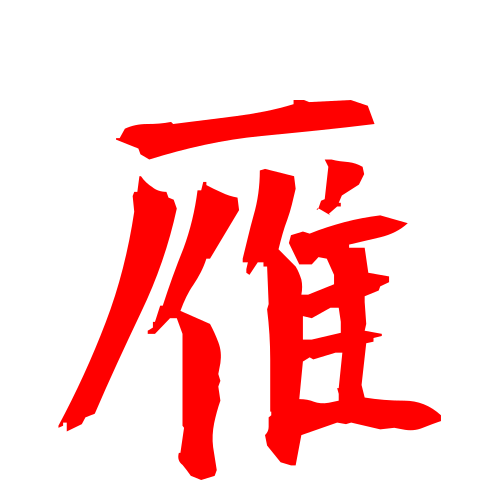 | 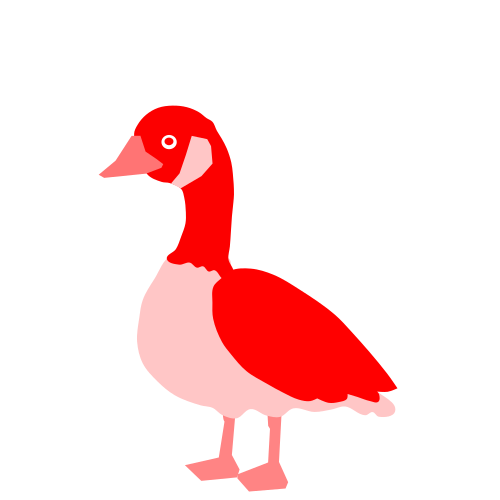 |


# 関連記事
* [「禽将棋」アプリリリースしました](https://happyclam.github.io/software/2019-01-02/torishogi)
* [「禽将棋」アプリについて](https://happyclam.github.io/project/2019-01-03/torishogiapp)

# 機能
* 多言語UI（日本語、英語）
* SVG駒使用。フォント駒（楷書、毛筆）とイラスト駒
* AI対戦
* 一手毎の棋譜保存機能
* 棋譜入出力機能（棋譜はCSA形式に倣ってますが独自形式です）

# ビルド
```
$ npm install
$ npm run dev
```

# テスト
```
$ NODE_OPTIONS="--max-old-space-size=24576" npx mocha --require coffeescript/register --require test/setup.coffee "test/**/*.coffee"
```

# クレジット
* 鳥のイラストは、Irasutoya氏の作品を基にしています。  
  https://www.irasutoya.com/

  これらの画像は、本プロジェクトで使用するために、修正およびSVGアセットに変換されています。
* 毛筆フォントは、青柳衡山氏の再配布可能な「衡山毛筆フォント」を利用しています。  
  http://www7a.biglobe.ne.jp/~kouzan/  
  https://forest.watch.impress.co.jp/library/software/aoyagifont/


# Play online
https://happyclam.github.io/toriShogi/

